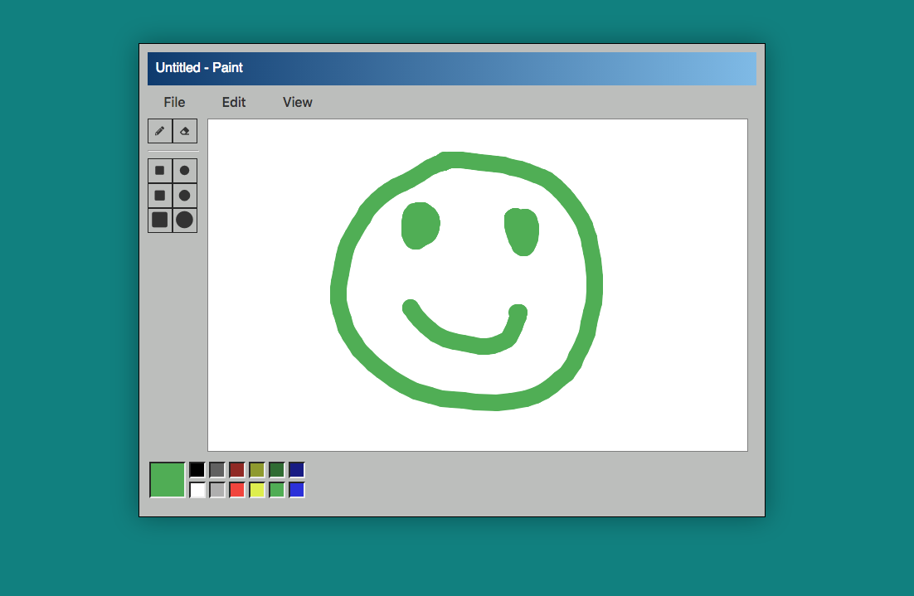

# Vanilla JavaScript Paint App

This application uses plain JavaScript, Canvas, and CSS.
The app keeps track of each stroke giving the option of undo and redo (Ctrl + Z, Ctrl  + Y).
Also, uses the browser Local Storage to save the files.

Features to be added in the future:
  * Paint bucket.
  * Save files in Firebase instead of Local Storage.

[Open App](https://pablo-jurado.github.io/paint-canvas/)

# Screenshot

